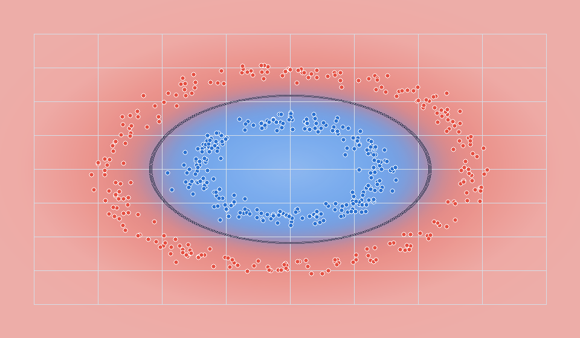
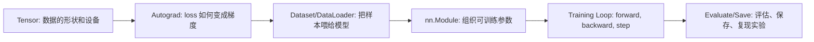

# PyTorch Roadmap Lab


一份面向初学者的 PyTorch 项目式学习仓库：用一个二维分类任务，把张量、自动求导、数据加载、`nn.Module`、训练循环、GPU、保存模型和调试清单串起来。

这里不是 API 目录，也不是博客搬运。目标是让你能在 1 到 2 小时内亲手跑通一条完整训练链路，然后知道每个报错该往哪里查。



## 你会学到什么



## 快速开始

Windows PowerShell:

```powershell
python -m venv .venv
.\.venv\Scripts\Activate.ps1
pip install -e ".[dev]"
python examples\03_train_toy_classifier.py
```

macOS/Linux:

```bash
python -m venv .venv
source .venv/bin/activate
pip install -e ".[dev]"
python examples/03_train_toy_classifier.py
```

训练脚本会生成一个可分的二维玩具数据集，训练一个小 MLP，并把权重保存到 `artifacts/tiny_classifier.pt`。

想看模型边界，可以在训练后运行：

```bash
python scripts/plot_decision_boundary.py
```

输出会保存到 `assets/decision-boundary.png`。如果你把这张图提交到仓库首页，访客能一眼看到这个项目不是空壳笔记。

没有安装 PyTorch 时，也可以先生成首页预览图：

```bash
python scripts/render_readme_preview.py
```

## 学习路线

| 阶段 | 主题 | 你要能说清楚 |
| --- | --- | --- |
| 01 | [Tensor 基础](docs/01-tensors.md) | `shape`、`dtype`、`device` 为什么比变量名更重要 |
| 02 | [Autograd](docs/02-autograd.md) | 哪些张量会记录梯度，什么时候要 `zero_grad()` |
| 03 | [Dataset 与 DataLoader](docs/03-dataset-dataloader.md) | 样本、批次、shuffle、训练/验证集怎么配合 |
| 04 | [模型与训练循环](docs/04-model-training.md) | `forward -> loss -> backward -> step` 的最小闭环 |
| 05 | [GPU、保存与可视化](docs/05-gpu-save-tensorboard.md) | 如何让代码自动选设备，并保存可复现实验结果 |
| 06 | [排错清单](docs/06-debug-checklist.md) | 维度错、梯度断、loss 不降时先查什么 |
| 07 | [FAQ](docs/07-faq.md) | 初学者最常问的学习顺序、报错和环境问题 |

## 仓库结构

```text
.
├── docs/                         # 原创学习笔记，按主题拆分
├── examples/                     # 可直接运行的小实验
├── exercises/                    # 带 TODO 的练习
├── src/pytorch_roadmap_lab/      # 可复用数据、模型、训练工具
└── tests/                        # 基础行为测试
```

## 推荐玩法

1. 先跑 `examples/01_tensor_playground.py`，把每一行输出的 shape 写在旁边。
2. 再跑 `examples/02_autograd_probe.py`，观察手写线性回归的参数如何靠梯度靠近真值。
3. 最后跑 `examples/03_train_toy_classifier.py`，把 epoch、learning rate、hidden size 改一改，记录效果。
4. 做 `exercises/`，优先补 shape 和 Dataset 练习。这两个地方最容易卡住，也最值得练。

## 为什么值得收藏

- 完全离线可跑，不需要下载 MNIST 或 CIFAR。
- 每个主题都有一个小目标，不要求先啃完大段文档。
- 示例代码尽量保留训练工程里的真实结构：数据、模型、训练、评估、保存分开写。
- 排错清单按真实报错思路组织，适合训练时边看边查。

## 参考资料

- [PyTorch 官方 Quickstart](https://docs.pytorch.org/tutorials/beginner/basics/quickstart_tutorial.html)
- [PyTorch Autograd 机制说明](https://docs.pytorch.org/docs/stable/notes/autograd.html)
- [torch.utils.data 文档](https://docs.pytorch.org/docs/stable/data.html)
- [torch.nn.Module 文档](https://docs.pytorch.org/docs/stable/generated/torch.nn.Module.html)

本仓库的文本、代码和组织方式为重新创作。若你引用别人的文章、课程或示例，请遵守对应许可证并保留出处。
